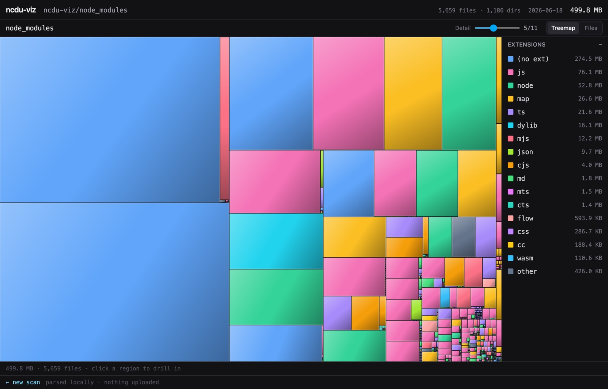

# ncdu-viz

### ▶ Live: **[ncdu-viz.nickysemenza.com](https://ncdu-viz.nickysemenza.com)**

A public, anonymous web app that ingests the output of `ncdu -o file.json` and
renders it as a drill-down **cushion treemap** disk-usage visualizer (think
GrandPerspective / Disk Inventory X). No auth, no accounts, no database — scans
live in R2 and auto-expire after 7 days.

[](https://ncdu-viz.nickysemenza.com)

Two ingest paths, both returning a shareable viewer URL:

```bash
# pipe from a headless server
ncdu -o- / | gzip | curl -s --data-binary @- \
  -H "Content-Encoding: gzip" https://ncdu-viz.nickysemenza.com/api/upload
```

…or drag-drop a `file.json` (optionally gzipped) in the browser — with a
**View locally** mode that parses entirely in your browser and uploads nothing.
The landing page also has an **example scan** to explore without any setup.

The viewer toggles between the **Treemap** and a **Files** list (every file under
the current focus, sorted by size descending) — both follow drill-down + breadcrumb
navigation. A **detail slider** caps the treemap's recursion depth (relative to the
current focus), collapsing deep directories into single aggregated cells so huge
scans stay legible; it auto-defaults to a sensible level. Shared scans show a
**countdown to expiry** and a **delete-now** button.

## Stack

- **Cloudflare Workers + Hono** for the API; **React + Vite** SPA served via
  `@cloudflare/vite-plugin` (workerd in dev, HMR, local binding emulation).
- **R2** for scan blobs (the only persistent store). **Workers Rate Limiting**
  on upload.
- **Canvas 2D** treemap rendering; **d3-hierarchy** (`treemapSquarify`) for layout.
- **Web Worker** (Comlink) decompresses + parses off the main thread.
- TypeScript strict throughout, shared types between Worker and client, typed
  API client via Hono RPC (`hc`).
- Tooling: **oxlint** (`--type-aware`) + **oxfmt** + **Vitest**.

## Layout

```
src/
  shared/      # runtime-agnostic + tested: ncdu parser, treemap layout, decode,
               #   color/format, slug, signature gate, DTOs
  worker/      # Hono app: POST /api/upload (multipart R2), GET /api/scan/:slug
  client/      # React SPA: landing/dropzone, viewer (canvas), parse Web Worker
fixtures/      # sample.json (real ncdu 2.9.2 output) for parser tests
```

## Develop

```bash
pnpm install
pnpm dev          # vite + workerd, http://localhost:5173
pnpm test         # vitest (parser, layout, decode, slug, signature, API handlers)
pnpm typecheck    # tsc --noEmit (app + tests)
pnpm lint         # oxlint --type-aware
pnpm format       # oxfmt
pnpm build        # tsc --noEmit && vite build
```

## How it works (the non-obvious parts)

- **Defensive parser, not Zod-per-node.** A real scan is hundreds of thousands
  to millions of nodes; Zod runs only at the boundary (the 4-element header
  tuple + metadata, the upload/response DTOs, R2 `customMetadata` on read). The
  tree itself is walked by a hand-rolled recursive parser that never throws on a
  single bad node. See [src/shared/ncdu.ts](src/shared/ncdu.ts).
- **Anti-abuse signature gate.** `/api/upload` peeks the first ~64 KB, inflates
  just that head if gzipped, and rejects anything that isn't an ncdu export
  (415) — the endpoint only ever accepts scans. See
  [src/shared/signature.ts](src/shared/signature.ts).
- **Streaming multipart R2 upload.** R2 `put()` needs a known length, but the
  curl pipe is chunked (no Content-Length) and a 200 MB blob can't be buffered
  in a 128 MB Worker. So the body streams through a counting size-cap into an R2
  **multipart upload**, aborting cleanly on overflow. See
  [src/worker/upload.ts](src/worker/upload.ts).
- **Single-gzip serving.** Blobs stored gzipped are served with
  `Content-Encoding: gzip` **and** `encodeBody: "manual"` — without "manual",
  workerd silently re-gzips into gzip-in-gzip. See
  [src/worker/scan.ts](src/worker/scan.ts).

## Deploy

See [DEPLOY.md](DEPLOY.md).

## TODO

- Dedupe hard links by `ino` (v1 sums as-is, as ncdu already counts each inode
  once per tree).
- Very large scans (multi-GB JSON) would move to a server-side aggregate + lazy
  subtree loading; v1 parses client-side in a Web Worker (fine to ~hundreds of MB).
